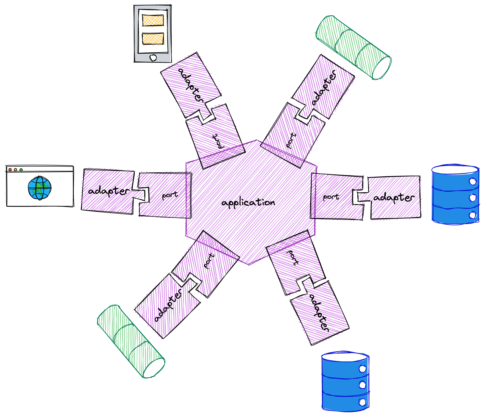
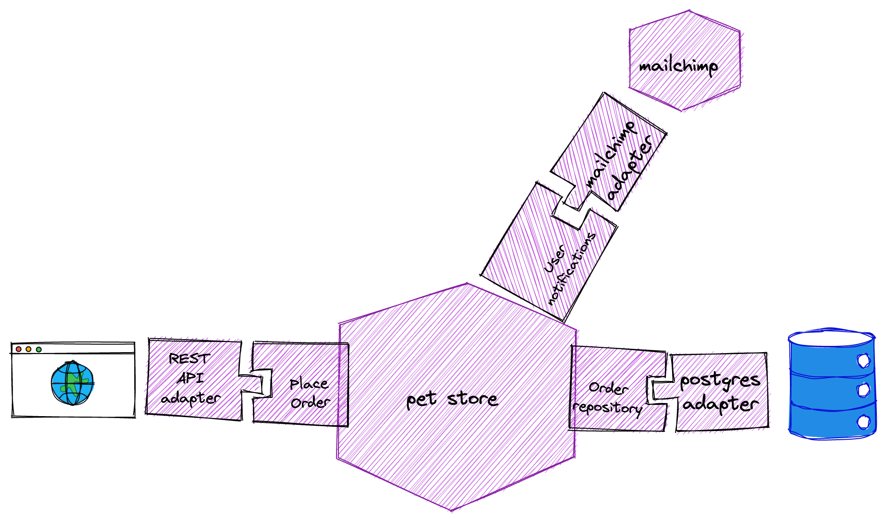
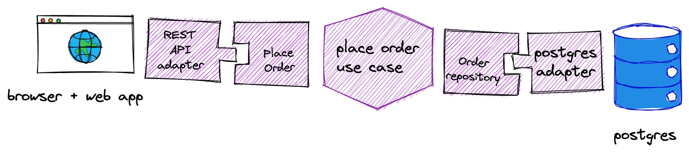
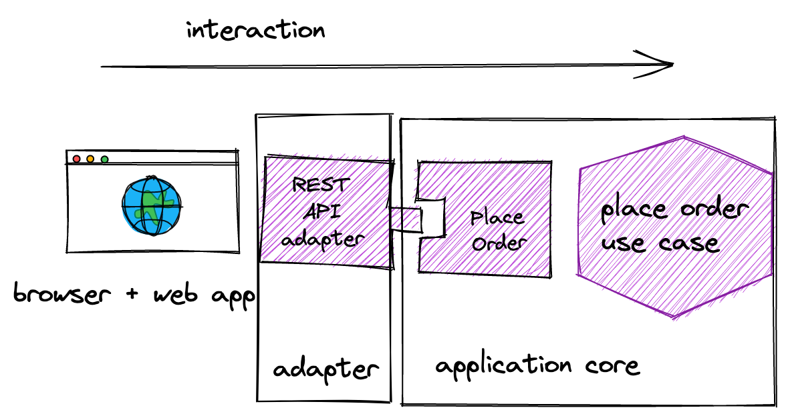
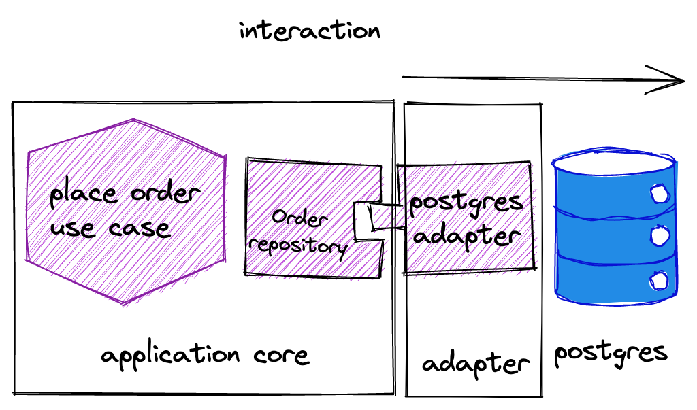
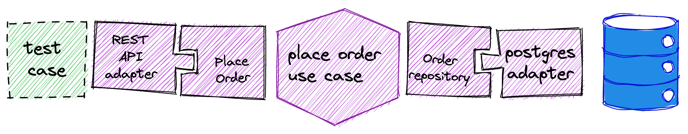
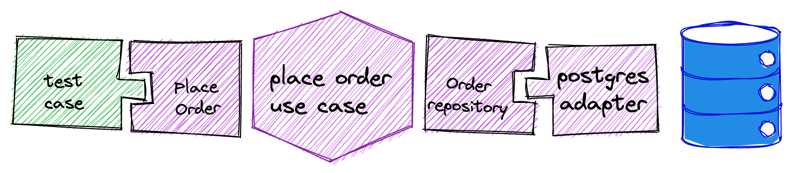
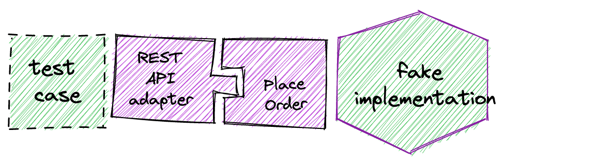
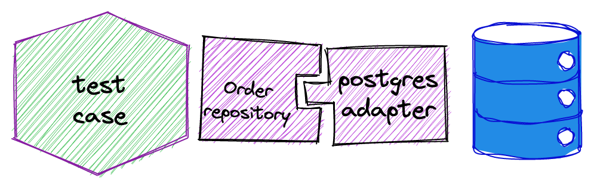

# Hexagonal architecture

> Disclaimer: This is not an authoritative source, it is just a collection of ideas and opinions gathered after reading a lot and trying to implement this architecture pattern in real life systems. This is just the author's interpretation of what is an hexagonal architecture, why would we want to implement one and how would we do it.

[Hexagonal architecture](https://alistair.cockburn.us/hexagonal-architecture/) (a.k.a. Ports & Adapters) is a term originally coined by Alistair Cockburn to describe an application architecture where there is a clear distinction between the code that implements the business logic for the application and the code that connects it to the external systems that will support it (like user interfaces, databases, message brokers, etc.). 



The name "hexagonal" comes from the convention that shows the application core as an hexagon. This has nothing to do with the number of layers or components in the system. The idea behind the hexagon is that there is no ordering between adapters (there is no up/down, right/left or top/bottom).


## Ports and adapters

This architecture is also known as **ports and adapters** because of the way that the application core communicates with the outside world: There are some well-defined connection points (the **ports**) and some code that uses them to connect the application core to the external systems (the **adapters**).

> A **port** is a contract between the application core and the external systems.  
An **adapter** is a component that connects the application core to an external system following the port's contract.

In terms of code, a port is typically implemented by defining some kind of **interface** (that is, a list of operations with no actual implementation). These interfaces allows us to isolate the different parts of the system as all they know about each other is the API defined by the port. This reduces coupling between the system components. As we said, though, the port is more than just a list of operations, it is a contract between the application core and the external systems.

Some examples of ports can be:

* The set of operations that implement the "check-out order" use case
* The set of operations that allow the application to persist the order to the database
* The set of operations that allow the application to send an e-mail to the user
* The set of operations that will be exposed in our HTTP REST API

In an e-commerce system we could have ports and adapters like these:



In the above diagram we have the pet-store application (the hexagon) and three ports:

* The order repository (allows the application to store the orders externally)
* The user notifications port (allows the application to send notifications to its users)
* The "place order" use case port (allows the UI to actually place orders)

Of course, in a real system we would have many more ports and adapters (like a payments system, a procuring system, etc.) but let's keep it simple for now.

### The ports

How would that look in code? As we said, each port is usually implemented using an interface:

```scala
trait OrderRepository {
  def placeOrder(customer: CustomerId, lines: list: OrderLine)
  def findOrdersByCustomer(id: CustomerId): List[Order]
}
```

In this case, the interface allows the application core to place orders and also to find the orders for a given customer without needing to know where exactly these orders are being stored. There are some semantics associated to these operations. It also makes sense to think that, as part of the contract, we would expect that, if we place an order for a given customer using the `placeOrder` method, we will expect it to show up if we call `findOrdersByCustomer` with the same customer id.

### The adapters

In order to make our application useful we still need a way to store our orders in the database. In this case, we will have a postgres adapter for our order repository port:

```scala
class PostgresOrderRepository(connection: java.sql.Connection) extends OrderRepository {
  
  override def placeOrder(customer: CustomerId, lines: list: OrderLine) = ...
 
  override def findOrdersByCustomer(id: CustomerId): List[Order] = {
    sql"select * from orders where customer_id=$id".query[Order]
  }
}
```

As we said before, the adapter is the glue code that connects the application core with an external system using the provided ports.

### Why ports and adapters?

Ports and adapters allow us to establish a clear separation between domain and infrastructure code. If you are familiar with the SOLID principles this will probably remind you of the [Dependency Inversion Principle](https://en.wikipedia.org/wiki/Dependency_inversion_principle): Using ports and adapters make it easy for us to make the infrastructure code depend on the domain code instead of the other way around.

In a hexagonal architecture, the domain code would be the application core and the infrastructure code would be the adapters. The port code belongs to the application core (as there will be code in the application core that will depend on those interfaces). It is important that we define the ports at the abstraction level of the domain, not the infrastructure. We should not find stuff like connections, transactions, etc. in the port operations.

There are two main benefits to this approach:

* If the infrastructure changes (we want to switch to a different database) or we need to support different alternatives (we are building an on-prem application that can be installed using several different database technologies) we can just replace the `PostgresOrderRepository` with something else and we will not need to change the application core.  
This helps us follow the Single Responsibility Principle (the S in SOLID) because the application core will not need to change when there are infrastructure changes.

* We can replace the actual implementation of the port with a "fake" one for testing (we will talk more about this later)


### Driven and driver ports


Looking back at our e-commerce system we can see two different ports:

* The REST API adapter reacts to HTTP requests and uses the "Place Order" port to tell the application core that a new order needs to be placed
* The Postgres order repository adapter provides permanent storage of the order using the postgres database.

In the first case, it is the adapter who will initiate the interaction with the application core while, in the second case, it is the application core who will initiate the interaction with the database.

#### Driver Ports


We call **driver** ports to the ports that are defined so that others can start an interaction with the application core, usually as a reaction to an external event like a UI event, an HTTP request, etc.

#### Driven ports




We call **driven** ports to the ones where it is the application core who initiates the interaction.

At the code level, the adapter for a driver port **uses** the interface (that is implemented by the application core) while the adapter for a driven port **implements** the port interface and it is the application core who uses it.

## Combination with other architecture patterns

The hexagonal architecture is a very simple pattern. We basically need to separate "domain stuff" from "plumbing stuff" and define some contact points. It does not say anything about how to structure the application core or the adapters and this is why it is usually combined with other architecture patterns.

### Clean architecture

We can see the [clean architecture](https://blog.cleancoder.com/uncle-bob/2012/08/13/the-clean-architecture.html) as a case of hexagonal architecture where we have refined each component into a set of layers (like Controllers <-> Use cases <-> Entities for the application core).

### Three tiered architecture

We can also see the traditional [three tiered architecture](https://www.ibm.com/topics/three-tier-architecture) as a case of hexagonal architecture where we have one big driver adapter (the presentation layer), another big driven adapter (the data layer) and an application core (the application layer). The main difference (and one of the problems of the three tier architecture) is that, in that architecture, the application layer depends on the data layer, which is something that we want to avoid with hexagonal architecture.

### DDD 4 layer architecture

Compared with the original [DDD 4 layer architecture](https://www.nareshbhatia.dev/articles/domain-driven-design-6-layered-architecture) we can see that they are very similar. It is like we just organized the application core in two layers, the application layer (that would contain the driver ports) and the domain layer. Again, it is not clear in this architecture where do the driven ports belong (in the linked article, the diagram puts them in the infrastructure layer, which would vioalte the DIP principle).

## Testing

As we mentioned earlier, make testing easier is one of the reasons why we might want to implement a hexagonal architecture. As we have seen, we have three types of components:

* The adapters for the driven ports (we need to test that they behave in accordance to what the application core expects)
* The adapters for the driver ports (we need to test that they translate properly the external events into calls to the operations provided by the application core)
* The application core (we need to check that we have implemented the business logic correctly).


### End to end testing

One way to test our system would be by testing all the components at the same time. In web applications, we can use tools like [selenium](https://www.selenium.dev/), [cypress](https://www.cypress.io/) or [nightwatch](https://nightwatchjs.org/) to automate a browser and exercise the whole application against the real external systems. We can also emulate the HTTP requests to a REST API if the system under test is an API instead of a web application.



End to end tests don't benefit from the hexagonal architecture as they are exercising the whole application. One problem with e2e tests is that they are typically slow to run and also they need some external infrastructure (like a real database) which usually leads to problems isolating the different test cases (we have to be careful that we don't read data from other tests that share the database with us, etc.).

Another problem is that, when they fail, they provide little information on the component where the problem lies, as we are exercising all of them (a unit test would make it trivial to know the component at fault as it would be testing only one component).

This is why we usually only test the "happy path" this way and use other types of tests to test specific behaviours of the system. The hexagonal architecture can help us a lot with these other tests.

### Application core unit testing


One area where the hexagonal architecture shines is in the unit testing of the business logic. We can use the driver ports to exercise the business logic from our test code and replace the driven ports with [test doubles](https://martinfowler.com/bliki/TestDouble.html) like a stub or a fake implementation.

A problem of fake implementations (and also with stubs) is that we need to make sure that they behave as the replaced adapter would behave. For example, if the postgres adapter is going to throw a `SQLException` (even though it should not) testing with a fake implementation that does not throw the `SQLException` will make it impossible for us to test the error handling code.

Ideally, we should test our fake implementations using the same test suite that we use to test the production adapter to make sure that, from the application core point of view, both adhere to the same contract.

Stubs have an additional problem: We need to know how the application core is going to use the adapter in order to program the responses accordingly. In doing this, we are coupling the test to the actual implementation (and we risk testing the implementation instead of just the behaviour). For example, changing from this implementation:
```scala
def markAsPaid(order: Order) {
  orderRepository.markAsPaid(order.id)
}
```
to this:
```scala
def markAsPaid(order: Order) {
  if (!orderRepository.isAlreadyPaid(order.id)) {
    orderRepository.markAsPaid(order.id)
  }
}
```
means that now we need to change the test code to provide a response for `isAlreadyPaid` or the test will fail. Tests written this way can be difficult to mantain as we will need to update them every time we change the application logic.

### Application core integration testing



We might also want to test the application core using the real external services, specially in situations like these:

* We have some business rules encoded as triggers or procedures in the database and it is difficult to emulate them
* The cost of using the external services is low (like we can easily create a new database schema for each test case without incurring in big delays)

If we can pay the price of using the external system for testing, this is a way to reduce the test code in our project. In the long run, though, as the business logic evolves, it might become harder to test it this way.

### Driver port adapter unit testing



As we already said, the behaviour of a driver port adapter is, usually, to respond to some kind of external event (a UI event, an HTTP request, a kafka message, etc.) and invoke the appropiate operation of the driver port, handle any errors and sometimes transforming the result into something that can be sent back to the external system.

It is relatively simple to test this, all we need is to create a test double for the application core that can record the invocations and provide some canned results. The problem, though, is that, as we mentioned when we talked about test stubs, using mocks for testing usually leads to tests that are too coupled to the actual implementation and end up testing the implementation, not the behaviour.


### Driver port adapter integration testing


In this case, we would be testing the adapter integrated with the application core but, unlike in a e2e test, we will be mocking the driven port adapters. This can make testing some scenarios more difficult (like certain error conditions), specially because it might be difficult to tell if the business logic was correctly invocated just by looking at the test doubles for the driven port adapters.

Also, when one of these tests fails, it might be difficult to tell whether the failure is in the driver port adapter or in the business logic itself.

In some situations, this could be a substitute for the application core unit tests (we just test everything through the adapter instead of using the driver port directly).

### Driven port adapter testing



Driven port adapter tests are unit tests in the sense that we are testing just one component (the adapter) but, at the same time, we can see them as integration tests because we will usually use an external system to test them. 

It is difficult to generalize when considering these kind of tests because the possibilites that we have will depend on the infrastructure that we are going to connect. As a rule of thumb, generally we need:

* To be able to set the external system in a known state so that 
  * We can write assertions based on the state of the system before and after the operation execution
  * We can write assertions on the data that the adapter reads from the external system (like in a database query)
* To have an isolated environment for each test so that we can run them concurrently (otherwise we might be introducing into some [flakyness](https://www.jetbrains.com/teamcity/ci-cd-guide/concepts/flaky-tests/)) into our test suite)
* To set up the environment for each test quickly so that the added time of all the set-up phases doesn't take too long

The easiest way to provide isolation between tests is ... to not run them concurrently. Of course, this is far from ideal because doing this will make our test suite slow and that will lead to lots of wasted time waiting for the test suite to run.

Another possibility these days is to use containers as each container can contain a clean copy of the state and we can even start several instances (one for each test) using libraries like [test containers](https://www.testcontainers.org/). The problem with that is that the performance is not very good as it can take several seconds to start each of these containers.

If the external system provides some namespacing capability (like using a different schema in a relational database, or a different topic in kafka) we can use it to make sure that each test starts with a unique namespace that is unknwon to any other test. We might need to initialize the space (this should not be a problem if we are using some kind of migrations library like [flyway](https://flywaydb.org/)) but this can be faster than starting a new container anyway.

If we cannot provide an isolated space for each test, we can still get isolation if we make sure that each test uses a different set of ids for the data items and we are careful when reading data from the external system so that we don't accidentally read data from another test. This is, though, an error-prone approach and should be avoided when possible.
